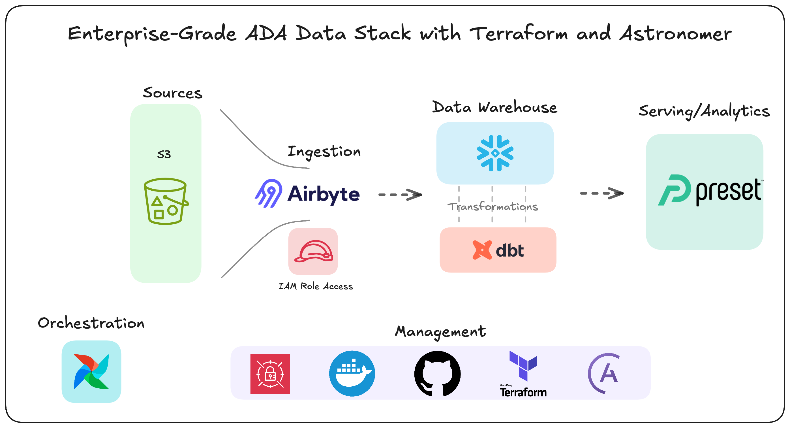
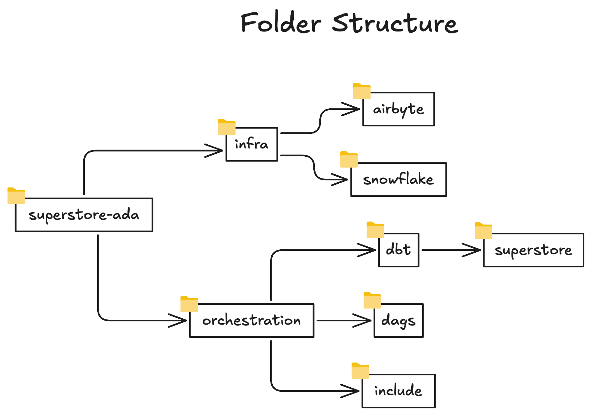

# Superstore ADA (Airflow DBT Airbyte)

## Table of Contents
1. [Introduction](#introduction)
2. [Installation](#getting-started)
3. [Tech Debt](#tech-debt)
4. [Resources](#resources)

## Introduction
In today’s fast-paced digital economy, e-commerce businesses generate vast amounts of data—but without the right strategy and infrastructure, that data remains an untapped asset. This repository documents the implementation of an end-to-end data platform for an e-commerce business, leveraging cutting-edge technologies from the Modern Data Stack (MDS).

Our mission? To leverage cutting-edge technologies  to transform raw data into actionable insights, optimising operations and unlocking new growth opportunities through the development of  a scalable, efficient, and automated data ecosystem that streamlines data ingestion, transformation, orchestration, and serving, enabling advanced analytics and decision-making.



*Data Ingestion:* Airbyte for automated extraction from diverse sources
*Data Storage:* Snowflake for scalable cloud warehousing
*Transformations* dbt SQL-based ELT transformations with CI/CD integration
*Orchestration* Airflow for dependecy management, for pipeline automation and scheduling.
*BI Analytics* Preset for interactive reporting and insights
*Ops Management:* Astronomer for Airflow setup, Terraform for infrastructure provisioning and CI/CD automation, AWS for state storage and credentials management

## Getting Started

### Requirements
- Python 3.12.3 
- Docker and Docker Compose
- Airbyte OSS version or Cloud *There's a configuration to perform the sync in either, but cloud version requires a* [15 day Airbyte trial account](https://cloud.airbyte.com/signup)
- Terraform v1.9.2 on darwin_arm64
- Snowflake [30 days trial account](https://signup.snowflake.com)
- Astro CLI [Astro CLI setup instructions](https://docs.astronomer.io/astro/cli/install-cli)

> [!NOTE] 
> Bear in mind that each project setup (Terraform, DBT, Airflow) requires their specifics modules and versions. Check lock files within the projects.


### Environment Setup
Create the folder ***infra*** for the infrastructure provisioning. Contains Terraform codebase to provision resources both in Snowflake and Airbyte.

Create the folder ***orchestration*** for airflow and dbt setup. The following structure is created once we start the project using the following command from the astro CLI:

```bash
astro dev init
``` 




The dbt project folder is created with the following command:
```bash
dbt init superstore
```

> [!NOTE] 
> Make sure you `cd` to the specific folder where you want the projects for airflow and dbt setup


## Tech Debt

### Security
 Based on [Airbyte Docs](https://docs.airbyte.com/integrations/sources/s3) authentication through IAM role is not available for OSS and also need to be enabled for Airbyte Cloud by someone in the Airbyte Team, hence secret access key method was used, which is not the most secure. 

Destination = "SNOWFLAKE" not possible to set authentication for user through [Key Pair Authentication](https://docs.snowflake.com/en/user-guide/key-pair-auth) hence a password had to be allocated to the user to authenticate which is not optimal.

## Resources

[S3 Source Configuration](https://docs.airbyte.com/integrations/sources/s3)

[Airbyte Terraform Provider](https://reference.airbyte.com/reference/using-the-terraform-provider#3-create-a-source)

[AWS Secrets for Terraform Credential Management](https://spacelift.io/blog/terraform-secrets)

[Airbyte API Authentication](https://prb68668.us-east-1.snowflakecomputing.com)

[Airflow Setup with Astronomer](https://www.astronomer.io/docs/astro/cli/run-airflow-locally)

[Orchestrate dbt Core jobs with Airflow and Cosmos](https://www.astronomer.io/docs/learn/airflow-dbt/)

[DBT Core + Airflow](https://astronomer.github.io/astronomer-cosmos/)

[Cross DAG Dependencies](https://www.astronomer.io/docs/learn/cross-dag-dependencies/#implement-cross-dag-dependencies)

[Event Driven DAG Schedule](https://www.astronomer.io/docs/learn/airflow-datasets/#conditional-dataset-scheduling)

